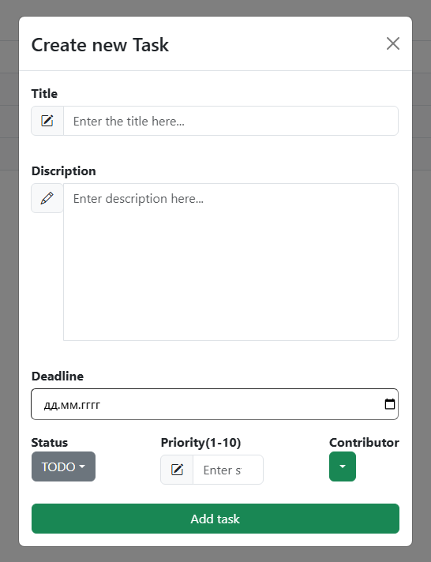

# Task manager project

This is a university project that has grown into a much more complex and powerful system than initially expected.

It is a **task manager** application that I am continuously improving by adding new features, implementing different algorithms, and applying advanced architectural decisions.

This project also serves as an **internship demo** to showcase my skills and passion for backend and frontend development.

Throughout development, I faced and solved many technical challenges, which helped me gain strong experience working with:

**Spring Security** (CSRF tokens, CORS policy, JWT Authentication)

**WebSockets** (real-time updates with STOMP over SockJS, JWT-secured connections)

**Hibernate & Spring Data JPA** (database interactions)

**Elasticsearch** (advanced searching capabilities)

## Screenshots of my application



## Technologies
### Backend

- Java 17 / Spring Boot 3.4.4 / Spring Security
- Hibernate / Spring Data JPA
- PostgreSQL (database)
- WebSockets (real-time feature)
- STOMP / SockJS
- JWT tokens (authentication and authorization)
- Elasticsearch (live search functionality)
- Default WebSocket message broker

### Frontend 

- React 18 / Vite
- Bootstrap 5 (responsive UI)

## Installation and setup

1. Clone the repository

```githubexpressionlanguage
git clone https://github.com/AlexPorokhnya/task-manager-project
```

2. Build and run
```shell
./mvnw spring-boot:run
cd React/my-app
npm install
npm run dev
```
The frontend will be available at http://localhost:5173


